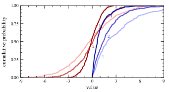

# Overview

A collection of scripts using the "[Gri](https://github.com/dankelley/gri)" engine (developed by [Dan Kelley](https://github.com/dankelley) and Peter Galbraith) to generate publication-quality plots from column data in regular text files.

# Plotting scripts
## `plot.gri`

Arbitrarily styled plots of columnar data collected across multiple input data files.

## `plot_distribution.gri`

Distributions are automatically generated from (unsorted) data columns in (multiple) text files.

