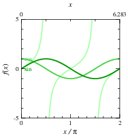
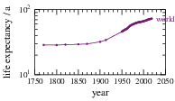
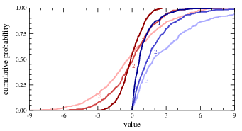

# Disclaimer
The following examples assume that the environment variable `$GRI` is pointing to the path of "gri-plotting".

# Usage

Call each script without any argument for a list of available options and usage hints:

`gri $GRI/plot`

`gri $GRI/plot_distribution`

# Examples

The `examples/scripts` folder contains a number of fully worked out usage examples based on data in `examples/data` that result in the diagrams collected in `gallery`.

## plot.gri

   1. Colored series with a second x axis and data gaps:

   [](gallery/harmonic_colormap.pdf)

   ```
   line solid \
   colormap green \
   label initial \
   secondx \
   linear '$x$' %g 0 6.283 0 4 \
   gap -999999 \
   clip \
   frame inch 2 \
   linear '$x / \pi$' %g 0 2 2 6 $(echo '1/3.1416' | bc -l) \
   linear '$f(x)$' %g -5 5 2 5 1 \
   ```

   1. Time series with symbols connected by lines:
     
   [](gallery/GlobalLifeExpectancy.pdf)
    
   ```
   line solid \
   linewidth 0.5 \
   symbol dot \
   color 'rgb 0.45 0.10 0.45' \
   label outside \a
   aspect 0.5 \
   frame inch 2 \
   linear 'year' %g 1750 2050 6 5 1 \
   log 'life expectancy / a' %g 10 100 2 1 1 \
   ```

## plot_distribution.gri

   1. Comparison of normal (red) and exponential (blue) distributions:
     
   [](gallery/distributions.pdf)
    
   ```
   colormap own \
   label \
   clip \
   aspect 0.5 \
   frame inch 4 \
   linear 'value' %g -9 9 6 3 1 \
   ```

